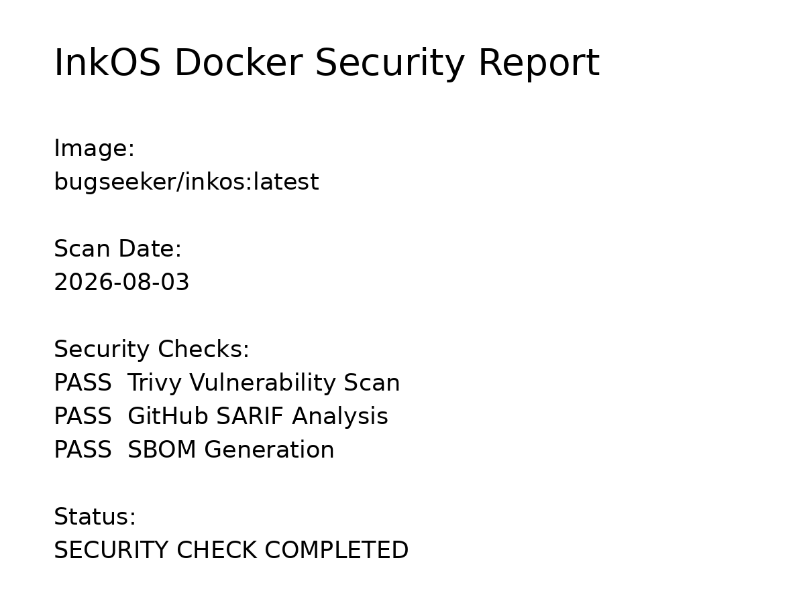

# Security Policy


## InkOS Docker 安全策略


本项目：

https://github.com/LetterCard/inkos-docker


为 InkOS 提供 Docker 化部署方案。


目标：

- 稳定运行
- 安全维护
- 可追踪构建
- 透明发布


---

# 🔐 安全设计


本项目采用：


```
最小化运行环境

+

自动漏洞扫描

+

软件供应链管理

+

版本可追溯
```


---

# 🐳 基础镜像安全


使用：

```
node:22-bookworm-slim
```


优势：

- 官方维护
- 精简系统
- 减少攻击面
- 生命周期明确


---

# 🔍 自动安全检测


每次镜像发布流程：


```
Docker Build

↓

Trivy Scan

↓

GitHub Security

↓

SBOM生成

↓

Docker Hub发布
```


---

# 🛡 Trivy 漏洞扫描


扫描范围：


## 系统组件


包括：

- Linux 软件包
- 基础镜像漏洞
- 已知 CVE


## 应用依赖


包括：

- Node.js 依赖
- npm/pnpm 包
- 第三方组件


重点关注：

```
HIGH

CRITICAL
```


---

# 📋 SBOM 软件清单


每个版本生成：


```
Software Bill of Materials
```


包含：

- 软件组件
- 版本信息
- 依赖关系


用途：

- 软件供应链审计
- 漏洞追踪
- 安全分析


---

# 📊 安全报告


公开安全报告：


https://github.com/LetterCard/inkos-docker/tree/main/security-reports




包含：

```
security-reports/
│
├── security-report.png      ⭐ Docker Hub展示
│
├── security-status.md       简洁状态
│
├── trivy-report.md          完整漏洞扫描
│
└── sbom.spdx.json           软件供应链清单
```


GitHub Security：

https://github.com/LetterCard/inkos-docker/security


---

# 🔑 密钥管理


本项目不会提交：

```
.env

API Key

Token

Secret
```


用户配置应该保存于：


```
/root/.inkos
```


例如：

```
/vol1/docker/inkos/config
```


---

# 💾 数据安全


用户数据通过 Docker Volume 保存。


包括：


```
/root/.inkos

/workspace

/logs
```


升级镜像不会覆盖：

- 用户配置
- 创作项目
- 日志数据


---

# 🚨 漏洞反馈


如果发现安全问题：

请提交 Issue：

https://github.com/LetterCard/inkos-docker/issues


建议提供：

- 问题描述
- 影响范围
- 复现方式
- 相关日志


---

# 📦 维护信息


上游项目：

https://github.com/Narcooo/inkos


Docker 维护：

https://github.com/LetterCard/inkos-docker


维护者：

**bugseeker**
